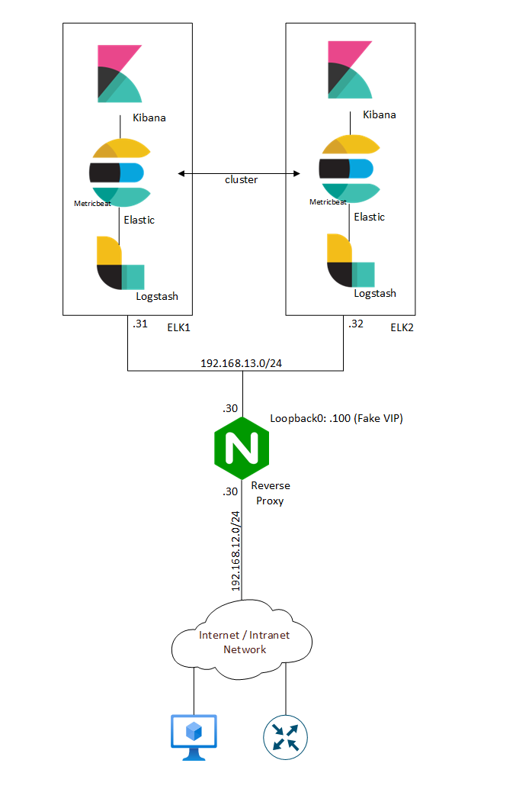

# IaC-Nginx-ELK
Purpose of this LAB is to demonstrate how to use Infrastructure as Code aproach to configure: Nginx (reverse proxy), Elasticsearch, Logstash and Kibana, with the use of Ansible and Github workflows (pipelines).  

HLD: different network devices are sending syslog type of traffic towards the collectors (placed in different DCs). To make the solution resilient Nginix servers were deployed infront of the ELK stacks. 

  
*Syslog flow: high level design*

Below drawing presents more detailed design of a single Nginx reverse proxy server and two ELK stacks connected in a cluster. Network hosts are sending syslogs to IP address: 192.168.13.100, which is a loopback interface of Nginix reverse proxy server. This setup allows us:
- seamlessly replace the backend servers  
- scale up/down number of backend servers  

  
*Nginx, ELK stack: general design + IP address scheme*

> [!NOTE]
> Ansible: To elevate privileges for Ansible instalation, I've used: sudo -S.  
> Ansible: For passing sudo and user password to Nginx, I've used: sshpass. Installed on self-hosted runner.
> Logstash: CAP_NET_BIND_SERVICE allows to bind a socket to Internet domain privileged ports (port numbers less than 1024).
