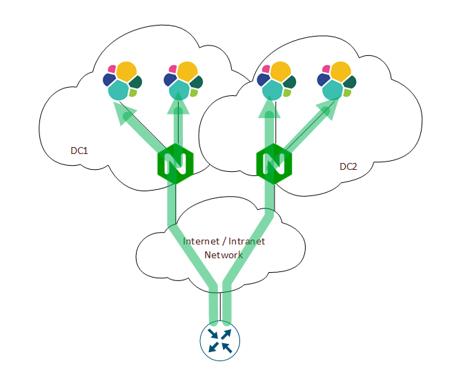
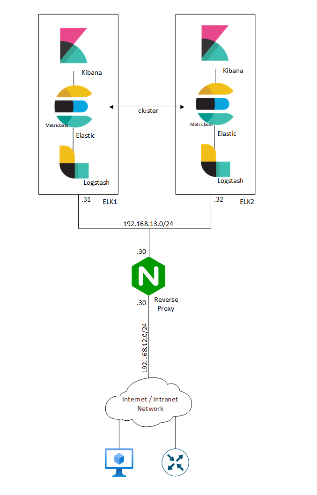

# IaC-Nginx-ELK
Purpose of this LAB is to demonstrate how to use Infrastructure as Code aproach to configure: Nginx (reverse proxy), Elasticsearch, Logstash, Kibana, with the use of Ansible and Github workflows (pipelines).  

  
*Syslog flow: high level design*

  
*Nginx, ELK stack: general design + IP address scheme*

> [!NOTE]
> To elevate privileges for Ansible instalation, I've used: sudo -S.
> For passing sudo and user password to Nginx, I've used: sshpass. Installed on self-hosted runner.
